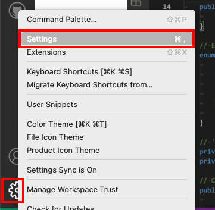
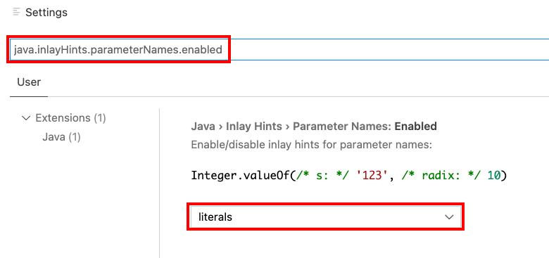
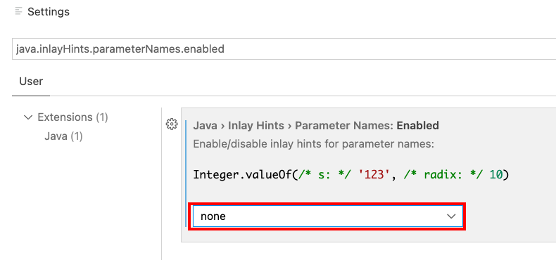
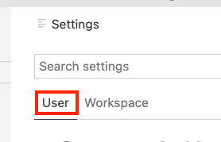

# Java inlay Hints parameter

Na atualização do VSCode (Release 1.67.0) veio a opção de usar o "Java inlay Hints parameter".  
Que fez aparecer mais informações relacionada ao código no próprio editor. Bom, uma ótima iniciativa do pessoal que está atualizando o VSCode. Mas acho que este tipo de "informação extra" pode confundir um pouco os alunos de IP.

Eu vou mostrar para os alunos como fazer para desabilitar está opção:

- configurações do VSCode:
  

- digitar "java.inlayHints.parameterNames.enabled" em "Search settings"
  

- alterar "literals" para "none"
  

Observem de estar na aba "User" e não na aba "Workspace", pois assim está mudança vai refletir em todos os projetos deste usuário, e não só no projeto ativo no momento.  
  
