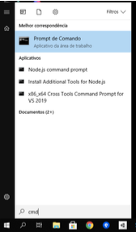

# Java: verificar a versão

Para verificar qual versão do Java está instalado no seu computador podes abrir o console do Windows pressionando a tecla Windows e depois digitando “cmd" e pressionar “enter”. Se for Linux ou MacOS abra o “terminal"  
  

Agora digite:

```terminal
javac -version
```

e

```terminal
java -version
```
