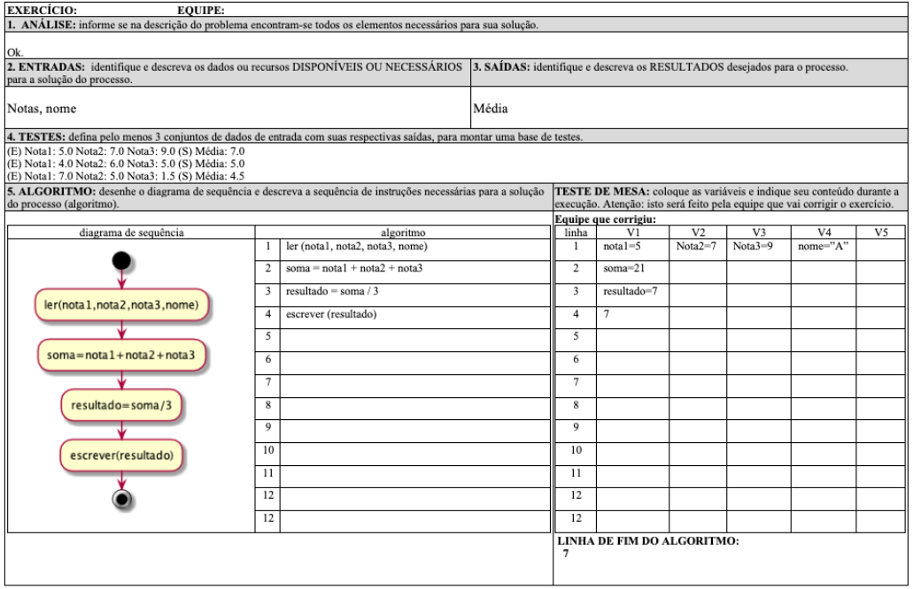
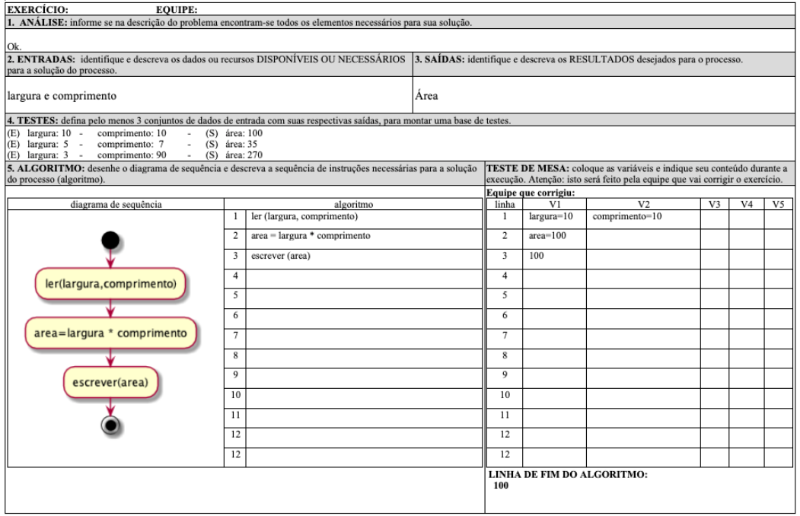

[Questionário 2]: <https://ava3.furb.br/mod/quiz/view.php?id=820664> "Questionário 2"  

# Introdução à Programação - Unidade 2

Algumas anotações feitas na aula: [aulaAnotacoes.md](./aulaAnotacoes.md "aulaAnotacoes.md")  

## Construção de Algoritmos - parte 1

### [Videoaula_2_1 (16:19)](<https://furb-my.sharepoint.com/:v:/g/personal/dalton_furb_br/EVlEcOSNE1dMvrqhbFRgFOgBmYqKrGGqjicI7SocBGPnbA?e=V7ZsYu> "link alternativo da primeira videoaula da unidade 2")  
<!--
Videoaula_2_1 (16:19): [<https://web.microsoftstream.com/video/b74928f9-3000-4c46-9a1e-42b0aabaa94c>](https://web.microsoftstream.com/video/b74928f9-3000-4c46-9a1e-42b0aabaa94c "primeira videoaula da unidade 2")  
-->

### Solução de Problemas

  

### Etapas para a Solução de Problemas​

- A **especificação** da solução de um problema com base em um software exige algumas **etapas** (requisitos) fundamentais:​  
  - entender o problema proposto (**interpretação**);​  
  - verificar os **dados** e recursos disponíveis para resolvê-lo (**entradas**);​  
  - identificar os **dados** ou resultados que se deseja alcançar (**saídas**);​  
  - definir e redigir os passos gerais para a solução do problema (**processos** ou **regras**);​  
  - descrever formalmente os passos para a solução do problema em uma linguagem clara e sem ambiguidades (**representação da solução**);​  
  - testar a solução (**testes**).​  
- Após a análise e modelagem do problema é que se passa para o processo de implementação computacional do programa (**programação**).​  

### Identificar Dados de Entrada e Saída​

- Um problema computacional normalmente manipula dados e informações.​  
- As entradas e saídas de um programa são obtidas através da análise dos **substantivos**.​  
- Os dados podem ser divididos em três tipos:​  
  - dados de entrada: são as informações ou recursos disponíveis para resolver um determinado problema utilizando o computador.  
  - dados intermediários: são informações intermediárias que ocorrem ao longo de um processo de solução do problema, mas que ainda não são a solução desejada.  
  - dados de saída: são as informações que se deseja obter como resultado do problema.  
- Em um programa de computador **dados** são tratados como **variáveis**.​  
- As **variáveis** armazenam valores na memória do computador e são caracterizadas por seu tipo.​  
- Os tipos primitivos são destacados a seguir:​  
  - Numérico Inteiro​: contém um número natural​ (ex.: Idade = 18 ou Quantidade = 3);  
  - Numérico Real: contém um número com casas decimais (ex.: Salário = 1215,76​ ou Altura = 1,95);  
  - Alfanumérico: contém caracteres ou sequências de caracteres alfanuméricos​ (ex.: Letra = ‘A’, Símbolo = ‘@’ ou Texto = "Teste de Texto");  
  - Lógico: contém verdadeiro ou falso​ (ex.: Sucesso = verdadeiro ou Triste = falso).  

#### Exemplos - parte 1

- Problema 1: considerando que um professor tem 3 notas de um aluno, calcule a média do aluno.​  

        entradas: 3 notas (numéricos reais)​  
        saída: média (numérico real)  

- Problema 2: considerando que uma pessoa tem a largura e o comprimento de uma sala retangular, calcule a área da sala.​  

        entradas: largura e comprimento (numéricos reais)​  
        saída: área (numérico real)​  

### Descrever a Solução do Problema - parte 1

- Na descrição da solução de um problema utilizam-se **expressões** e **operadores**.  
- As **expressões** têm por finalidade verificar ou transformar os dados em um algoritmo.  
- As expressões contam com **operadores** que permitem realizar as ações sobre os dados de um determinado algoritmo.​  

#### Expressões/Operações/Comandos​

| Tipo       | Descrição                                     |  
| ---------- | --------------------------------------------- |  
| Atribuição | Existem informações em um programa que precisam ser armazenadas em **variáveis**. Nestes casos, utiliza-se uma expressão de atribuição.​  A atribuição é representada por um flecha para a esquerda ( <- ) ou pelo sinal de igual ( = ) |  
| Entrada e Saída | Os programas normalmente recebem e informam dados executando operações denominadas de entrada (comando “ler”) e saída (comando “escrever”).  

### Exercícios

- Responda o quiz no AVA3: [Questionário 2]​.  
- Acompanhe os exercício em sala​.  

----------

## Construção de Algoritmos - parte 2

### [Videoaula_2_2 (22:58)](<https://furb-my.sharepoint.com/:v:/g/personal/dalton_furb_br/ESboEsA6q0ZKkvnYS2z8qqEBATr4x5__gT4YFu_9MSeP_w?e=C7YWr7> "link alternativo da segunda videoaula da unidade 2")  

### Descrever a Solução do Problema​ - parte 2

| Tipo       | Descrição                                     |  
| ---------- | --------------------------------------------- |  
| Estruturas de Controle de Seleção e Repetição | Em um programa podem existir comandos executados apenas em determinadas situações. Nestes casos utilizam-se as estruturas de seleção.  Em outras situações, um comando precisa ser executado repetidas vezes. Nestes casos, utilizam-se as estruturas de repetição.​ |  
| Chamadas de Sub-rotinas | Muitas vezes em um programa, a solução de um **algoritmo**, requer a execução de outros **algoritmos**. |  
| Tratamentos de Erros| Muitas situações na programação de computadores requerem cuidado pois podem gerar diversos tipos de erros. Nas linguagens mais modernas, existem estruturas específicas para o tratamento destes erros. |  

### Operações de Atribuição​

- Um comando de atribuição permite que o **resultado de uma expressão**, ou o valor de uma variável ou constante seja armazenado em uma **variável**.​  
- O comando de atribuição indica que a variável deve receber um conteúdo.​  
- O símbolo que representa uma atribuição é uma seta apontada para a esquerda (←), que indica que o valor da expressão à direita deve ser armazenado na variável à esquerda:  
  - Exemplo 1  

        atribuir o valor 5 à variável A​​
        A ← 5​
        
  - Exemplo 2

        atribuir o valor de A somado de 2 unidades à variável B
        B ← A + 2​

  - Exemplo 3

        concatenar dois nomes com um espaço​​
        nome ← nome1 + " " + nome2​

### Operadores

| operador | descrição |  
| -------- | --------- |  
| +, - | operadores unários: são aplicados a um único operando. São os operadores aritméticos de maior precedência. Exemplos: -3, +x |  
| +, -, *, / | operadores aritméticos: são aplicados para adição, subtração, multiplicação e divisão respectivamente. Por convenção, * e / têm precedência sobre + e -. Para modificar a ordem de avaliação das operações, é necessário usar parênteses como em qualquer expressão aritmética |  
| % | operador de resto: é aplicado para o resto da divisão de números inteiros. Por exemplo, 10 % 3 = 1. Tem a mesma precedência do operador de divisão tradicional. Estes operadores podem variar de acordo com a notação utilizada pela pseudolinguagem |  
| + | operador de caracteres: operador de concatenação de cadeias de caracteres, quando usado com dois valores (variáveis ou constantes) do tipo "caractere". Por exemplo: "Rio " + " de Janeiro" = "Rio de Janeiro" |  

### Operações de Entrada e Saída

- Os **comandos de entrada e saída** são usados para inserir dados em um programa (**ler**) ou apresentar os resultados de um programa (**escrever**).​  
- Os **dados de entrada** devem ser inseridos em um programa através do comando de **leitura**.​  
- Os **dados de saída** devem ser mostrados através dos comandos de **escrita**.​  

#### Comando de Entrada

- O comando de entrada utilizado em algoritmos é o comando **ler**.  
- Com este comando o algoritmo aguarda que o usuário insira um valor que será **armazenado na memória do computador**.  
- Este comando exige que seja colocado o **nome da variável** onde a informação digitada será armazenada.​  

##### Sintaxe

        ler (variável)

##### Exemplos - parte 2

- aguarda que seja digitado um valor a ser armazenado na variável A

        ler (A)

- aguarda que seja digitado um valor a ser armazenado na variável nome​

        ler (nome)

#### Comando de Saída

- O comando de saída utilizado em algoritmos é o comando **escrever**.  
- Com este comando o algoritmo mostra o resultado de uma expressão definida pelo usuário.  
- A expressão a ser escrita pode ser o nome de uma **variável**, um **texto** ou uma **expressão matemática**, ou até mesmo uma combinação entre estas separadas por vírgulas.​  

##### Sintaxe

        escrever (expressão)

##### Exemplos

- escreve o valor da variável X​

        escrever (X)

- escreve um texto

        escrever (“Boa noite!”)

- escreve uma expressão (o resultado da soma de 2 variáveis)​

        escrever (A + B)

- escreve um texto e o conteúdo de uma variável

        escrever (“Idade do aluno = “, idade)

### Formulário Para Análise e Especificação da Solução de Problemas

- Existem algumas opções que podem ser usadas no processo de Análise e Especificação da Solução de Problemas. Uma delas e o uso de um formulário para ajudar neste processo. Abaixo se tem o uso de um formulário com dois exemplos do seu uso.  

#### Exemplo 1

- Um professor deseja calcular a média de um aluno. O professor tem o nome e as 3 notas do aluno e a média deve ser calculada de forma aritmética.  

  

#### Exemplo 2

- Modele a solução de um problema para calcular a área de uma sala retangular. Considere que as medida estão expressas em metros.  

  

### Exercícios - parte 2

- Responda o quiz no AVA3: [Questionário 2]​.  
- Acompanhe os exercício em sala​.  

----------

### Principais Referências Bibliográficas​

- CARBONI, Irenice de Fátima. **[Lógica de programação](https://bu.furb.br/consulta/portalConsulta/recuperaMfnCompleto.php?menu=rapida&CdMFN=265888)**. São Paulo : Pioneira Thomson Learning, 2003. 240 p, il.​  
- MANZANO, José Augusto N. G; OLIVEIRA, Jayr Figueiredo de. **[Algoritmos: lógica para desenvolvimento de programação](https://bu.furb.br/consulta/portalConsulta/recuperaMfnCompleto.php?menu=rapida&CdMFN=98280)**. São Paulo : Erica, 1996. 265p.​  
- SOUZA, Marco Antônio Furlan de. **[Algoritmos e lógica de programação](https://bu.furb.br/consulta/portalConsulta/recuperaMfnCompleto.php?menu=rapida&CdMFN=306850)**. São Paulo : Pioneira Thomson, 2005. xxiii, 214 p, il.  
- VILARIM, Gilvan de Oliveira.  
  **[Algoritmos: programação para iniciantes.](https://bu.furb.br/consulta/portalConsulta/recuperaMfnCompleto.php?menu=rapida&CdMFN=319911)** 2. ed. Rio de Janeiro : Ciência Moderna, 2004. xiv, 270 p, il.​  
- XAVIER, Gley Fabiano Cardoso. **[Lógica de programação](https://bu.furb.br/consulta/portalConsulta/recuperaMfnCompleto.php?menu=rapida&CdMFN=267002)**. 7. ed. São Paulo : SENAC, 2004. xxv, 378 p, il. 1 CD-ROM. (Nova série informática).​  

----------

## ⏭ [Unidade 3)](../Unidade3/README.md "Unidade 3")  
