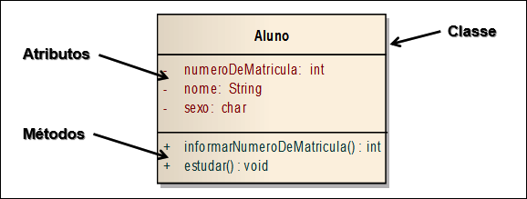
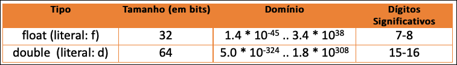
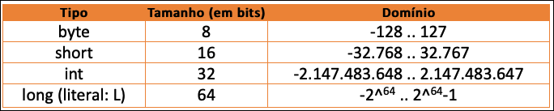
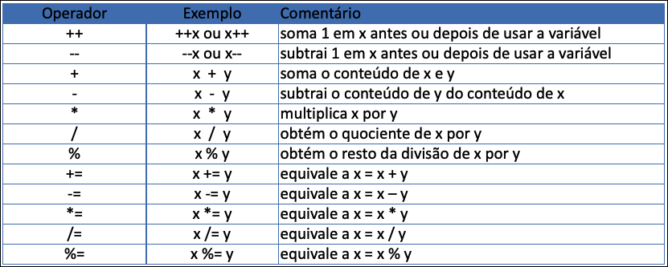

# Introdução à Programação - Unidade 3  

Algumas anotações feitas em aula: [aulaAnotacoes.md](./aulaAnotacoes.md "aulaAnotacoes.md")

## Introdução a Linguagem de Programação - Parte 1  

### [Videoaula_3_1 (27:27)](<https://furb-my.sharepoint.com/:v:/g/personal/dalton_furb_br/EexdwuO8TYFOjqLwiIFsk-IB3gntjsEbsw8nT4hj2_MXRA?e=3QpaaU> "link alternativo da primeira videoaula da unidade 3")  

### A Linguagem Java  

- Plataforma de programação iniciada pela Sun Microsystems e atualmente pertencente a Oracle;​  
- Linguagem de programação de propósito geral, concorrente, baseada em classes e orientada a objetos;​  
- Possui algumas semelhanças com as linguagens C e C++;​  
- É uma linguagem case sensitive, ou seja, diferencia maiúsculas de minúsculas e fortemente tipada;​  
- Independente de plataforma, pois seus programas são compilados em um formato próprio denominado bytecodes (.class).  

#### Características da Linguagem  Java  

- Origem:​  
  - linguagem originalmente desenvolvida para eletrodomésticos, portanto, simples e portável;​  
  - foi projetada para ser uma linguagem com características modernas de programação;​  
  - nasceu considerando a Internet como ambiente operacional.​  
- JRE x JDK​  
  - JRE (Java Runtime Environment): são as bibliotecas necessárias para executar um programa em Java​  
  - JDK (Java Development Toolkit): são as ferramentas necessárias para desenvolver aplicações em Java​  
- Versões​  
  - SE / EE / ME / FX​  

#### Orientação a Objetos​  

- A **Orientação a Objetos** (OO) modela o mundo a partir dos objetos existentes no mundo real.  
- Os objetos têm **Características** (atributos)  e **Comportamentos** (métodos) próprios, sendo definidos pelas **Classes** às quais pertencem.  
  

#### Estrutura de um Programa Java​  

- Em Java as classes tem uma estrutura básica:  

```java
public class Nome_da_classe {​
  //declaração dos atributos​
  //declaração e implementação dos métodos​
}
```

- Exemplo:  

```java
//classe
public class Aluno {
  int numeroDeMatricula;
  String nome;
  char sexo;

  int informarNumeroDeMatricula() {

    return 1;
  }

  void estudar() {
    
  }
}
```

- Deve-se notar o uso de **Chaves** para iniciar e fechar uma classe em Java.​  
- Por convenção o nome de uma classe sempre é iniciado por letra maiúscula.​  
- Uma aplicação desenvolvida em Java pode ser executado de **diversas formas**:  
  - no contexto de uma aplicação desktop em **modo texto** ou **modo gráfico**, como um **applet** ou como uma **aplicação JSP** na WEB, em um dispositivo móvel, etc.​  
- No nosso contexto, trataremos apenas de uma aplicação *desktop em modo texto*.​  

##### Estrutura de um Programa Java​: Método Main  

- Um programa *desktop* em Java é executado a partir de uma classe.​  
- Esta classe deve ter um método denominado **main**.​  
- Sintaxe:​  

```java
public class Principal {
  public static void main(String[] args) {
  }
}
```

- Exemplo: a classe a seguir irá escrever o conteúdo do comando System.out.println em uma janela em modo texto.  

```java
public class Principal {
  public static void main(String[] args) {
    System.out.println("FUNCIONA!!");
  }
}
```

#### Palavras Reservadas e Identificadores em Java​ - Parte 1  

- **Palavras Reservadas** são todos os nomes pré-existentes na linguagem que tem algum significado.  
  - Exemplos de palavras reservadas: public, class, int, double, etc.​  
- **Identificadores** são todos os nomes criados pelo programador. São utilizados para nomear classe, atributos e métodos. Os identificadores não podem ter nomes que sejam palavras reservadas. Devem iniciar por letras.​  

#### Definição de Variáveis em Java​  

- Em Java as variáveis devem ser declaradas e ter o seu tipo definido.​  

        tipo nome_variável;​
  ou

        tipo nome_variável = valor​;
  ou

        final tipo nome_variável = valor;
  Onde:​

        tipo: é o tipo da variável;​
        nome_variável: é o nome dado a variável;​
        valor: inicialização do variável;​
        final: indica que o valor do variável não pode ser alterado (é constante).
  Exemplos:​
  
  ```java
  char letra;​
  int numero = 10;​
  final double tamanho = 50;
  ```

#### Palavras Reservadas e Identificadores em Java​ - Parte 2  

- É possível definir um **Grupo de Variáveis** em uma mesma linha, usando o mesmo qualificador e tipo, separando-os por vírgula (,)​.  
- A definição de uma variável, ou grupo de variáveis, sempre é finalizada com o símbolo **Ponto-E-Vírgula** (;). Isto ocorre com a maioria dos programas em Java.​  
- Exemplo  

  ```java
  private char letra, caracter;​
  private int x, y = 2, z;
  ```

#### Tipos de Dados: Primitivos​  

##### Numéricos Reais  

  

##### Numéricos Inteiros  

  

##### Alfanumérico  

  

##### Lógico  

  

### Exercícios - Parte 1  

- Responda o quiz no AVA3​.  
- Acompanhe os exercício em sala​.  

----------

## Introdução a Linguagem de Programação - Parte 2  

### [Videoaula_3_2 (29:18)](<https://furb-my.sharepoint.com/:v:/g/personal/dalton_furb_br/ERMgPFCa4U1Gv3qfgMUkXTQBOoGeRqWi9zpSga2SxyM0Ag?e=E5gofQ> "link alternativo da segunda videoaula da unidade 3")  

### Operadores em Java  

#### Atribuição  

- O operador de **Atribuição** na linguagem Java é o **sinal de igual**.​  
- Na **Atribuição** a variável à esquerda recebe o valor da expressão à direita​.  
  - Exemplos  

    ```java
    x = 100;
    y = x + 3;
    ```

#### Aritméticos  

- Os operadores aritméticos permitem a execução de operações sobre as variáveis​.  
  

### Comandos de Entrada e Saída  

- Nas aplicações em modo texto, a interação do usuário com o sistema é feita através de uma janela em modo caractere, sem o uso de componentes gráficos.​  
- As classes usadas são a classe **Scanner** (entrada) e **System** (saída)​.  

#### Entrada  

- A entrada de dados em modo Texto pode ser feita usando a classe **Scanner​**;  
- A classe **Scanner** precisa da criação de um objeto para ser utilizada​;  
- O parâmetro System.in na criação do objeto indica que a leitura é feita do **teclado**;  

  ```java
  Scanner tec = new Scanner (System.in);​
  ```

- Alguns métodos disponíveis para leitura:​  

  | Comando       | Descrição                       |  
  | ----          | ----                            |  
  | nextInt()     | lê um valor inteiro​             |  
  | ​next()        | lê um string​                    |  
  | nextDouble()  | lê um número real​               |  
  | nextBoolean() | lê um valor lógico​              |  

- A classe Scanner pertence ao pacote java.util.Scanner e, portanto, deve ser importada.​  
​
#### Saída

- Para a escrita de dados em vídeo utiliza-se diretamente a classe **System**;  
- Para usar a classe System **não** é necessário a criação de um objeto;  
- Na classe System utiliza-se o objeto **out** seguido pelos métodos:​  
  - println: para exibir texto ou valores sem formatação​;  
  - printf: para exibir texto ou valores formatados​.  
​
Nos métodos print pode ser feita a concatenação de textos e conteúdos de variáveis, usando o operador +.​  

#### Exemplo  

- calcular a área de um sala retangular  
- Algoritmo  

      inicio​  
        ler a largura e o comprimento​
        calcular a área​
        escrever a área​
      Fim

- Em Java  

  ```java
  import java.util.Scanner;

  public class SalaTXT {
    public static void main(String[] args) {
      //criar o objeto de leitura dos dados​
      Scanner teclado = new Scanner (System.in);
      //ler dados e enviá-los ao objeto sala​
      System.out.println("Digite o comprimento");
      double comprimento = teclado.nextDouble();
      System.out.println("Digite a largura");
      double largura = teclado.nextDouble();
      //calcular e informar a área​
      double area = largura * comprimento;
      //escrever o resultado​
      System.out.println("Área=" + area);
      teclado.close();
    }
  }
  ```

#### Bibliotecas  

- Ao utilizar um método de uma classe de um determinado pacote em Java é necessário fazer sua **importação** através da diretiva ***import***.​  
- Exemplo  

  ```java
  import java.lang.Math; //contém métodos para cálculos matemáticos​
  import java.util.Scanner; //contém métodos para entrada de dados​
  ```

- O programador pode criar seus próprios pacotes  
- Algumas classes não precisam ser importadas e nem instanciadas. Estas classes têm a característica de serem **estáticas** e já estarem disponíveis na API (*Application Program Interface*) da linguagem.  
  - Exemplo : classe System​  

  ```java
  System.out.println("Digite o comprimento");
  ```

- A linguagem **Java** conta com bibliotecas de classes disponíveis em pacotes que podem ser utilizadas nos programas.​  
  - java.io: classes para entrada e saída de dados – ex. classe System, InputSream, OutputStream​  
  - java.lang: classes base da linguagem – ex. classe Object, Math, String, Character, Integer, Float, ....​  
  - java.util: classes para manipulação de dados – ex. classe Vector, Tokenizer, Scanner, Date, ...  
  - javax.swing: classes para criação de aplicações com interface gráfica – ex. classe JButton, JMenu, JOptionPane​.  

- Exemplos da biblioteca: java.lang.Math  
  
| Operação | Definição da Função |  
| -------- | ------------------- |  
| Potência​ | double pow(double a, double b) |  
| Raiz Quadrada​ | double sqrt(double a) |  
| Função Exponencial​ | double exp(double a) |  
| Logaritmo Natural​ | double log(double a) |  
| Valor Absoluto​ | double abs(double a) |  
| Cosseno​ | double cos(double a) // a em radianos​ |  
| Seno​ | double sin(double a) // a em radianos​ |  
| Tangente​ | double tan(double a) // a em radianos​ |  

- Exemplos da biblioteca: java.lang.String  

| Operação | Definição da Função |  
| -------- | ------------------- |  
| Tamanho​ | int length() |  
| Caracter​ | char charAt (int index)​ |  
| Comparar​ | boolean equals(Object anObject)​ |  
| Localizar​ | int compareTo(String anotherString) |  

- Exemplos da biblioteca: java.util  

| Operação | Definição da Função |  
| -------- | ------------------- |  
| Maiúscula​ | int toUpper(char c)​ |  
| Minúscula​ | int toLower(char c)​ |  

- Exemplos da biblioteca: java.lang.Character  

| Operação | Definição da Função |  
| -------- | ------------------- |  
| É alfabético​ | int isAlphabetic(char c)​ |  
| É numérico​ | int isDigit(char c)​ |  

### Padrão de Documentação  

- A **documentação de programas** tem diversos objetivos, entre os quais destacam:​  
  - facilitar sua manutenção;​  
  - manter um histórico de atualização;​  
  - facilitar a consulta e reuso das implementações realizadas​.  
- De única linha: //​  

  ```java
  // Exibe apenas a linha como comentário​
  ```

- De uma ou mais linhas: /* */​  

  ```java
  /* comentário que vai se estendendo até fechar com */​
  ```

- De documentação: /** */​  

  ```java
  /** Indicam que o comentário deve ser inserido em qualquer documentação gerada automaticamente pelo javadoc . */​
  ```

- O javadoc é uma **documentação padrão** em arquivos HTML para programas Java​  
- A documentação em Java deve inserir **tags** que permitem identificar informações sobre a classe​  
  
      @author: descreve o autor da classe​
      @version: descreve o número da versão atual ​
      @param: descreve os parâmetros de um método​
      @return: descreve o valor retornado por um método ​
​
- Além de uma boa documentação, os programas devem conter:​  
  - **identação**: recuos com espaços em branco para facilitar a visualização de sua estrutura  
  - **identificadores significativos**: nomes que definam o que de fato se quer representar.​  

### Etapas do processo de construção de um programa​  

1. **Especificação**: é a descrição da solução do problema conforme visto no capítulo anterior​.  
2. **Edição**: é a conversão e digitação da solução do problema para uma linguagem de programação​.  
3. **Compilação**: é a verificação da estrutura léxica, sintática e semântica do texto digitado para certificar se o mesmo está de acordo com a linguagem de programação.​  
4. **Montagem**: é a geração de um código intermediário não otimizado para ser executado pelo hardware.​  
5. **Ligação**: é a conversão do código intermediário para um código que seja entendido pelo hardware.​  
6. **Execução**: é a execução do programa para ser utilizado pelo usuário.​  

- Para poder ser portável em diferentes sistemas operacionais a linguagem **Java** gera o que se denomina de **bytecode**.​  

### Introdução a um Ambiente de Programação  

- Para se escrever um programa em uma **linguagem** normalmente utiliza-se um **ambiente de programação**.​  
- Um **ambiente de programação** concentra um conjunto de recursos que facilitam as etapas de construção de um programa na linguagem.​  
- Os ambientes são comumente denominados de **IDE (Integrated Development Environment – Ambiente Integrado de Desenvolvimento)​**  
- Exemplos de Ambientes para a linguagem Java:  
  - Eclipse​  
  - Netbeans​  
  - BlueJ​  
  - JCreator  ​
  - JBuilder​  
  - VSCode  
  - etc.​  

### Exercícios - Parte 2  

- Responda o quiz no AVA3​.  
- Acompanhe os exercício em sala​.  

----------

### Principais Referências Bibliográficas​  

- DEITEL, Paul J; DEITEL, Harvey M. **[Java: como programar.](https://bu.furb.br/consulta/portalConsulta/recuperaMfnCompleto.php?menu=rapida&CdMFN=341002)** 8. ed. São Paulo: Pearson, 2010. xxix, 1144 p, il.​  
- HORSTMANN, Cay S. **[Big Java.](https://bu.furb.br/consulta/portalConsulta/recuperaMfnCompleto.php?menu=rapida&CdMFN=271388)** Porto Alegre : Bookman, 2004. xi, 1125 p, il. , 1 CD-ROM.​  
- SCHILDT, Herbert; HOLMES, James. **[A arte do Java.](https://bu.furb.br/consulta/portalConsulta/recuperaMfnCompleto.php?menu=rapida&CdMFN=257427)** Rio de Janeiro : Elsevier : Campus, c2003. xvi, 382 p, il.​  
- OpenJDK. **[OpenJDK Documentation](https://devdocs.io/openjdk/)**. 2020. Disponível em: <https://devdocs.io/openjdk/>. Acesso em 4 de maio de 2020.  

----------

## ⏭ [Unidade 4)](../Unidade4/README.md "Unidade 4")  
