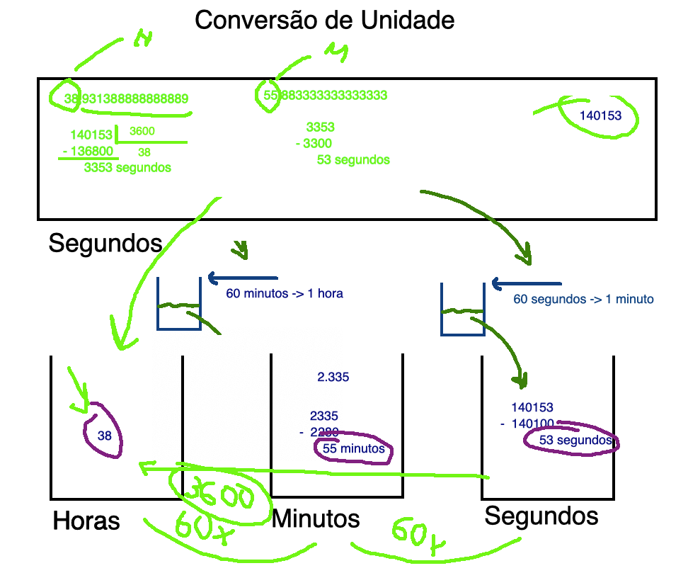

<!--  FIXME:
### [Aula_07](Unidade3/aulaAnotacoes.md#Aula_07 "	07-03-2022	segunda	")	07-03-2022	segunda
### [Aula_08](Unidade3/aulaAnotacoes.md#Aula_08 "	09-03-2022	quarta		09-03-2022	quarta
### [Aula_09](Unidade3/aulaAnotacoes.md#Aula_09 "	09-03-2022	quarta	")	09-03-2022	quarta
### [Aula_10](Unidade3/aulaAnotacoes.md#Aula_10 "	14-03-2022	segunda	")	14-03-2022	segunda
### [Aula_11](Unidade3/aulaAnotacoes.md#Aula_11 "	16-03-2022	quarta		16-03-2022	quarta
### [Aula_12](Unidade3/aulaAnotacoes.md#Aula_12 "	16-03-2022	quarta	")	16-03-2022	quarta
-->

# Algumas anotações das aulas

A importância de fazer um código legível ...  
  

## Rabiscos

## Introdução à Programação - Unidade 3

- Boas práticas de programação -> legibilidade do código  
  - [Indentação de código](https://pt.wikipedia.org/wiki/Indentação "Indentação de código");  
  - VSCode Formatar Documento (menu de contexto no código ou teclas ⇧⌥F macOs/Linux e teclas SHIFT+CRTL+F).  
- [x] Criar um novo projeto no VSCode para representar a Unidade 3 com o nome "Unidade3". Assim, lembrar como criar projeto e classe.  
- [x] Resgatar conteúdo da Unidade 1 ([Diagrama de Classes](../Unidade1/README.md#diagrama-de-classes)) e mostrar o que é classe e o que é o método main de forma superficial. Lembrar que todo o código vai dentro do método main!  
- [x] Resolver os primeiros exercícios (exemplos) [Atividades - Aula](atividadeAula.md "Atividades - Aula").  

<!-- TODO: 
comentar de saber quais imports devem ser usados.
Evitar algo do tipo: import java.util.* ; .. melhor import java.util.Scanner;
Pode usar View / Command Palette / >Organize Imports .. mas saber decidir qual usar
-->

### [Atividades - Aula](atividadeAula.md "Atividades - Aula")  

- [x] [Uni3Exe01.java](src/Uni3Exe01.java "Uni3Exe01.java") <!-- prof. completo -->  
- [x] [Uni3Exe02.java](src/Uni3Exe02.java "Uni3Exe02.java") <!-- prof. algoritmo 5 min. -->  
- [x] [Uni3Exe03.java](src/Uni3Exe03.java "Uni3Exe03.java") <!-- 10 min. -->  

----
Desenvolvimento de código (mostrar um exemplo de uso do DEBUG)  
  Executar código  
    RUN  
    DEBUG -> Testes de código  

    

    BreakPoint: marcar ponto de "parada" no código (círculo vermelho)  
    Controle da execução:  
      Stop: quadrado vermelho  
      Continue: continuar e para no próximo BreakPoint  
      Step Over: executar linha apor linha (instrução)  

<!-- para saber mais, avançado: <https://code.visualstudio.com/docs/java/java-debugging> -->
----

- [x] Uni3Exe04.java  
- [x] Uni3Exe05.java  
- [ ] Uni3Exe06.java
- [ ] Uni3Exe07.java  
- [ ] Uni3Exe08.java  
- [ ] Uni3Exe09.java  
- [ ] Uni3Exe10.java  <!-- prof. só o algoritmo -->  
- [x] Uni3Exe11.java  
- [ ] Uni3Exe12.java  
- [ ] Uni3Exe13.java  
- [ ] Uni3Exe14.java  
- [x] [Uni3Exe15.java](src/Uni3Exe15.java "Uni3Exe15.java") <!-- 15 min. -->  
- [ ] Uni3Exe16.java  

### [Atividades - URI](atividadeUri.md "Atividades - URI")

- Apresentar o URI, mostrar como eles fazem para entrar na turma.  
- Lembrar que devem utilizar o **Java 14 no URI**.  
- Resolver os dois primeiros exercícios do URI no VSCode e depois colocar no URI.  
- Para o Uni3Uri1002.java será necessário usar formatação, [DecimalFormat](/Exemplos/src/ExemploDecimalFormat.java "DecimalFormat").  

#### Resolução de exercícios URI individualmente pelos alunos  

- [x] [Uni3Uri1001.java](src/Uni3Uri1001.java "Uni3Uri1001.java") - [x] [fluxograma](fluxogramas/Uni3Uri1001.svg "fluxograma") <!-- prof. completo -->  
- [x] [Uni3Uri1002.java](src/Uni3Uri1002.java "Uni3Uri1002.java") - [x] [fluxograma](fluxogramas/Uni3Uri1002.svg "fluxograma") <!-- prof. algoritmo 10 min. -->  
- [x] Uni3Uri1004.java  
- [ ] Uni3Uri1005.java  
- [ ] Uni3Uri1007.java  
- [ ] Uni3Uri1008.java  
- [ ] Uni3Uri1009.java  
- [ ] Uni3Uri1010.java - [x] [fluxograma](fluxogramas/Uni3Uri1010.svg "fluxograma")  
- [ ] Uni3Uri1012.java - [x] [fluxograma](fluxogramas/Uni3Uri1012.svg "fluxograma")  
- [ ] Uni3Uri1015.java  
- [ ] Uni3Uri1016.java  
- [ ] Uni3Uri1018.java - [x] [fluxograma](fluxogramas/Uni3Uri1018.svg "fluxograma")  
- [ ] Uni3Uri1019.java  
- [ ] Uni3Uri1021.java  

#### Rabiscos do processo de entender os enunciados

- [x] Classe **Math**  **não** precisam importar ela (pacote base java.lang).  
- [x] Mostrar a documentação do OpenJDK os métodos da classe Math (<https://devdocs.io/openjdk~17/java.base/java/lang/math>) e, se der tempo, de outras classes como Scanner para acostuma-los a utilizar a documentação.  
- [x] Classe [Scanner](<https://devdocs.io/openjdk~17/java.base/java/util/scanner> "Scanner").  

##### Uni3Uri1019

[x]   
