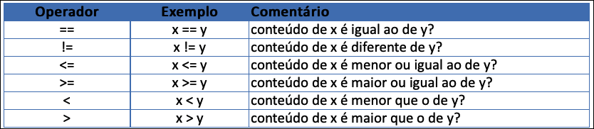

# Introdução à Programação - Unidade 4

Algumas anotações feitas em aula: [aulaAnotacoes.md](./aulaAnotacoes.md "aulaAnotacoes.md")

## Comandos de Controle de Fluxo: Seleção

### [Videoaula_4 (34:10)](<https://furb-my.sharepoint.com/:v:/g/personal/dalton_furb_br/EUiFijgkOtVDsYNwu2NBgJcBnhp13gFvPzOwftgwh_4R9A?e=9djRWd> "link alternativo da videoaula da unidade 4")

### Comandos de Controle de Fluxo​: Seleção

- Os comandos de controle de fluxo são utilizados para definir a sequência de passos a ser executada por um programa, de acordo com o estado de suas variáveis.
- Tipos de Comandos:​
  - de **seleção**: executam instruções de acordo com uma determinada condição​;
  - de **repetição**: executam instruções em um número repetido de vezes. Também são chamadas de “laços”​;
  - de **chama de sub-rotina**: executam a chamada de sub-rotinas com propriedades específicas.

#### Comandos de Controle de Fluxo​: Seleção

- As estruturas de **controle de seleção** são (entre parênteses seu nome em Java):​
  - simples: se (if)​
  - encadeada: se-senão (if – else)​
  - múltipla: escolha (switch case)
  
##### Comandos de Controle de Fluxo​: Seleção Simples: se

- As estruturas de **seleção simples** apresentam uma condição que determina se o bloco de comandos a seguir deve ou não ser executado.
- Ele será executado se a condição for **verdadeira**.​
- Exemplos:
  
      Se está chovendo então​
        abra o guarda-chuva​
      
      Se a biblioteca está aberta então​
        empreste o livro​

      Se não tem açúcar na limonada então​
        adoce a limonada​

      Se não está frio então​
        tire o casaco

- Sintaxe e exemplo simplificado para verificar se um aluno está aprovado em uma disciplina​.
- Em Português Estruturado:​

      se expressão-lógica então​
        seqüência-de-comandos​
      fim se

- Em Java (formato):​
  ```java
  if (expressão-lógica) {​
    [bloco-instrucoes-verdadeiro]​
  }
  ```

- Em Português Estruturado:​

      se media >= 6 então​
        situacao = “Aprovado”​
      fim se

- Em Java:​
  ```java
  if (media >= 6) {
    situacao = "aprovado";
  } 
  ```
- Em Java, se houver apenas um comando a ser executado dentro da estrutura de controle, as chaves podem ser dispensadas. No caso de mais de um comando, elas são obrigatórias.​

##### Operadores Relacionais em Java​

- Os operadores **relacionais** permitem a comparação entre variáveis e produzem um resultado lógico​.


##### Comandos de Controle de Fluxo​: Seleção Encadeada: se-então

- As **estruturas de seleção encadeadas** apresentam alternativas de ação diferentes de acordo com a situação avaliada.​
- Se a condição testada for **verdadeira** é executado um bloco de comandos. Se ela for **falsa**, é executado outro bloco de comandos.
- Exemplos:​

      Se está chovendo então​
        vou de carro​
      senão​
        vou de ônibus ​
      ​
      Se gosto de limonada com açúcar então​
        coloco açúcar na limonada ​
      senão​
        coloco adoçante na limonada​

- Sintaxe e exemplo para informar se um aluno está aprovado ou reprovado em uma disciplina:​
- Em Português Estruturado:​

      se expressão-lógica então​
        seqüência-de-comandos-verdadeiro​
      senão​
        seqüência-de-comandos-falso​
      fim se

- Em Java (formato):​
  ```java
  if (expressão-lógica) {​
    [bloco-instrucoes-verdadeiro]​
  } else {​
    [bloco-instrucoes-falso]​
  }
  ```

- Em Português Estruturado:​

      se media >= 6 então​
        situacao = “Aprovado”​
      senão​
        situacao = “Reprovado”​
      fim se​

- Em Java:​
  ```java
  if (media >= 6) {
    situacao = "aprovado";
  } else {
    situacao = "reprovado";
  }
  ```

##### Comandos de Controle de Fluxo​: Seleção Composta

- As **Estruturas de Seleção Compostas** apresentam mais de uma condição e podem ser simples ou encadeadas.​
- Devem ser utilizadas com os **Operadores Lógicos** E ou OU.​
- Exemplos:​

      Se está com sede e tem dinheiro então​​
        compre uma garrafa de água​
      ​
      Se está calor ou a água está quente então​​
        mergulhe na piscina​
      ​
      Se está chovendo e está fazendo frio e você está em casa então​​
        coma uma pipoca​
        tome um chá quente
      ​
      Se é final de semana e o tempo está bom então​​​
        vou à praia​
      Senão​​​
        fico em casa

##### Operadores Lógicos em Java​

- Os operadores **Lógicos** permitem realizar combinações de operações relacionais, juntando diversas decisões em uma única expressão​.

| Operação | Operador | Comentário |
| -------- | -------- | ---------- |
|  E | && | compara duas expressões avaliando o resultado como verdadeiro ou falso. Será verdadeiro se todas as expressões forem verdadeiras​ |
| OU | \|\| | compara duas expressões avaliando o resultado como verdadeiro ou falso. Será verdadeiro se pelo menos uma das expressões forem verdadeiras​ |
| Negação | ! | nega o resultado de uma expressão. Se for falso passa para verdadeiro. Se for verdadeiro passa para falso |

| E | OU | Negação |
| --- | --- | --- |
| V e V = V | V ou V = V | *não* V = F |
| V e F = F | V ou F = V | *não* F = V |
| F e V = F | F ou V = V |
| F e F = F | F ou F = F |

##### Comandos de Controle de Fluxo​: Seleção Composta

- Sintaxe e exemplo usando o E (&& em Java) para verificar se uma pessoa pode nadar em uma piscina.
- Em Português Estruturado:​

      se condição1 e condição2 então
        seqüência-de-comandos-verdadeiro​
      senão​
        seqüência-de-comandos-falso​
      fim se

- Em Java (formato):​
  ```java
  if (condição1 && condição2) {​
    [bloco-instrucoes-verdadeiro]​
  } else {​
    [bloco-instrucoes-falso]​
  }
  ```

- Em Português Estruturado:​

      se temperatura > 25 e agua = 'L' então​
        podeNadar = verdadeiro​
      senão​
        podeNadar = falso​
      fim se​

- Em Java:​
  ```java
  if (temperatura > 25 && agua == 'L') {
    podeNadar = true;
  } else {
    podeNadar = false;
  }
  ```

- Sintaxe e exemplo usando o OU (|| em Java) para verificar se uma pessoa pode pagar meia entrada.
- Em Português Estruturado:​

      se condição1 ou condição2 então
        seqüência-de-comandos-verdadeiro​
      senão​
        seqüência-de-comandos-falso​
      fim se

- Em Java (formato):​
  ```java
  if (condição1 || condição2) {​
    [bloco-instrucoes-verdadeiro]​
  } else {​
    [bloco-instrucoes-falso]​
  }
  ```

- Em Português Estruturado:​

      se idade < 18 ou idade >= 60 então​
        meiaEntrada = verdadeiro
      senão​
        meiaEntrada = falso​​
      fim se​

- Em Java:​
  ```java
  if (idade < 18 || idade >= 60) {
    meiaEntrada = true;
  } else {
    meiaEntrada = false;
  }
  ```

##### Comandos de Controle de Fluxo​: Seleção Múltipla: Escolha

- As estruturas de **Seleção Múltipla** permitem avaliar uma entre diversas alternativas​.
- Exemplos:​

      Escolha o tempo​​​
        sol : vou à praia​​
        chuva : fico em casa​​​
      ​
      Escolha a cor​​​
        verde : tenho esperança
        vermelho : estou apaixonado
        azul : está tudo tranquilo​

- Sintaxe e exemplo simplificado de um algoritmo para contar o número de pessoas de cada sexo.​
- Em Português Estruturado:​

      escolha <expressão-de-seleção>​
        opção 1 : <seqüência-de-comandos-1>​
        opção 2 : <seqüência-de-comandos-2>​
        .
        senão​
          <seqüência-de-comandos-extra>​

- Em Java (formato):​
  ```java
  switch (<expressão>) {​
    case 1 : 
      [bloco-de-comandos-1] ​
      break;​
    case 2 : 
      [bloco-de-comandos-2] ​
      break;​
    .​
    default : [bloco-de-comandos-default]​
  }

  ```

- Em Português Estruturado:​

      escolha sexo
        'F' : contF = contF + 1
        'M' : contM = contF + 1
        senão​
          contI = contI + 1​

- Em Java:​
  ```java
  switch (sexo) {
  case 'F':
    contF++;
    break;
  case 'M':
    contM++;
    break;
  default:
    contI++;
  }

  ```

- Em Java a **expressão** só pode ter como resultado um valor **numérico inteiro**, **caractere** ou **enumeração**.
- Em Java a opção senão é denominada de **default** e é opcional.​
- O **break** é utilizado para finalizar o **switch** e deve ser usado em cada condição.​
- As estruturas de **Seleção Múltipla** permitem avaliar uma entre diversas alternativas​.

### Exercícios

- Responda o quiz no AVA3​.
- Acompanhe os exercício em sala​.

----------

### Principais Referências Bibliográficas​

- CARBONI, Irenice de Fátima. **[Lógica de programação](https://bu.furb.br/consulta/portalConsulta/recuperaMfnCompleto.php?menu=rapida&CdMFN=265888)**. São Paulo : Pioneira Thomson Learning, 2003. 240 p, il.​
- MANZANO, José Augusto N. G; OLIVEIRA, Jayr Figueiredo de. **[Algoritmos: lógica para desenvolvimento de programação](https://bu.furb.br/consulta/portalConsulta/recuperaMfnCompleto.php?menu=rapida&CdMFN=98280)**. São Paulo : Erica, 1996. 265p.​
- SOUZA, Marco Antônio Furlan de. **[Algoritmos e lógica de programação](https://bu.furb.br/consulta/portalConsulta/recuperaMfnCompleto.php?menu=rapida&CdMFN=306850)**. São Paulo : Pioneira Thomson, 2005. xxiii, 214 p, il.
- VILARIM, Gilvan de Oliveira.
  **[Algoritmos: programação para iniciantes.](https://bu.furb.br/consulta/portalConsulta/recuperaMfnCompleto.php?menu=rapida&CdMFN=319911)**
  2. ed. Rio de Janeiro : Ciência Moderna, 2004. xiv, 270 p, il.​
- XAVIER, Gley Fabiano Cardoso. **[Lógica de programação](https://bu.furb.br/consulta/portalConsulta/recuperaMfnCompleto.php?menu=rapida&CdMFN=267002)**. 7. ed. São Paulo : SENAC, 2004. xxv, 378 p, il. 1 CD-ROM. (Nova série informática).​

----------

## ⏭ [Unidade 5)](../Unidade5/README.md "Unidade 5")  
