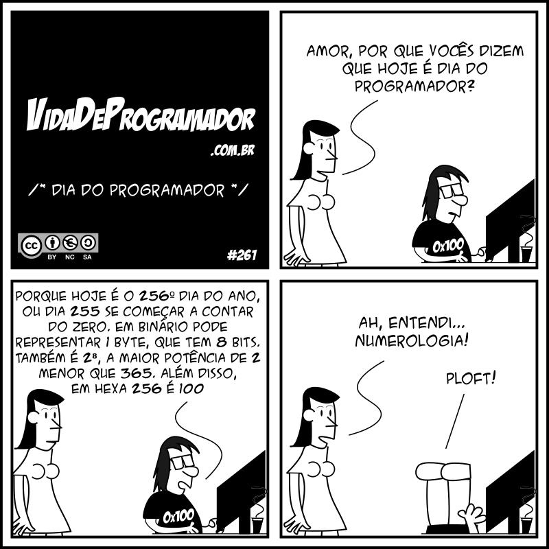

<!--  FIXME:
### [Aula_13](./aulaAnotacoes.md#Aula_13 "	21-03-2022	segunda	")	21-03-2022	segunda
### [Aula_14](./aulaAnotacoes.md#Aula_14 "	23-03-2022	quarta		23-03-2022	quarta
### [Aula_15](./aulaAnotacoes.md#Aula_15 "	23-03-2022	quarta	")	23-03-2022	quarta
### [Aula_16](./aulaAnotacoes.md#Aula_16 “	28-03-2022	segunda	")	28-03-2022	segunda
### [Aula_17](./aulaAnotacoes.md#Aula_17 “	30-03-2022	quarta		30-03-2022	quarta
### [Aula_18](./aulaAnotacoes.md#Aula_18 "	30-03-2022	quarta	")	30-03-2022	quarta
### [Aula_19](./aulaAnotacoes.md#Aula_19 "	04-04-2022	segunda	")	04-04-2022	segunda
### [Aula_20](./aulaAnotacoes.md#Aula_20 "	06-04-2022	quarta		06-04-2022	quarta
### [Aula_21](./aulaAnotacoes.md#Aula_21 "	06-04-2022	quarta	")	06-04-2022	quarta
-->

# Algumas anotações das aulas

Você sabe qual é o seu dia? ... o Dia do Programador, 13 de setembro  
  

## Rabiscos

[Fonte: CaixaAreia](./src/CaixaAreia.java "Fonte: CaixaAreia")  

## Introdução à Programação - Unidade 4

### [Atividades - Aula](./atividadeAula.md "Atividades - Aula")  

### [Aula_16-17](../cronograma.md#Aula_16-17)

### [Aula_18](../cronograma.md#Aula_18)

- [Variáveis e Operadores Lógicos](./README.md#operadores-lógicos-em-java​ "Variáveis lógicas")  
  true/false - 1/0 - yes/no  
  .. true/false  
- [Tabela de comparação: operadores relacionais](./README.md#operadores-relacionais-em-java​ "Tabela de comparação: operadores relacionais")  
- [x] Criar um novo projeto no VSCode para representar a Unidade 4 com o nome "Unidade4";  
- [x] Resgatar conteúdo da Unidade 4 e mostrar o que é o **Estruturas de Seleção: comando escolha**;  
  - Grupo SE (if);  
  - Grupo SE - SENÃO (if - else);  
  - Grupo COMPOSTO E e OU (&& e ||);  
  - Grupo ESCOLHA (switch);  
- [x] Resolver os primeiros exercícios (exemplos) [Atividades - Aula](./atividadeAula.md "Atividades - Aula").  

----------

#### Grupo SE (if)

  

- [Fonte: CondicionalSimples](./src/ExemploCondicional_Simples.java "Fonte: CondicionalSimples")  

- [x] [Uni4Exe01.java](./src/Uni4Exe01.java "Uni4Exe01.java") - [x] [fluxograma](./fluxogramas/Uni4Exe01.svg "fluxograma") <!-- prof. completo -->  

----------

#### Grupo SE - SENÃO (if - else)

  

- [Fonte: CondicionalEncadeada](./src/ExemploCondicionalEncadeada.java "Fonte: CondicionalEncadeada")  

  

- [Fonte: CondicionalEncadeadaGrande](./src/ExemploCondicionalEncadeadaGrande.java "Fonte: CondicionalEncadeadaGrande")  

- [x] [Uni4Exe02.java](./src/Uni4Exe02.java "Uni4Exe02.java") - [x] [fluxograma](./fluxogramas/Uni4Exe02.svg "fluxograma") <!-- prof. completo -->  
- [x] [Uni4Exe03.java](./src/Uni4Exe03.java "Uni4Exe03.java") <!-- aluno enviou -->  
- [ ] Uni4Exe04.java  
- [ ] Uni4Exe05.java - [x] [fluxograma](./fluxogramas/Uni4Exe05.svg "fluxograma")  
- [ ] Uni4Exe06.java  
- [ ] Uni4Exe07.java - [x] [fluxograma](./fluxogramas/Uni4Exe07.svg "fluxograma")  
<!-- TODO: tarefa, deixar uma parte e pedi para pensar em como terminar de resolver -->
- [x] [TesteTresIrmaos](./src/ExemploTesteTresIrmaos.java "TesteTresIrmaos")

### [Aula_19-20](../cronograma.md#Aula_19-20)

### [Aula_21](../cronograma.md#Aula_21)

----------

#### Grupo COMPOSTO E e OU (&& e ||)

  

- [Fonte: Composta E](./src/ExemploCondicionalCompostaE.java "Fonte: Composta E")  
- [Fonte: Composta OU](./src/ExemploCondicionalCompostaOU.java "Fonte: Composta OU")  

- [x] Uni4Exe08.java - [x] [fluxograma](./fluxogramas/Uni4Exe08.svg "fluxograma")  <!-- prof. completo -->  
- [ ] Uni4Exe09.java  
- [x] [Uni4Exe10.java](./src/Uni4Exe10.java "Uni4Exe10.java") <!-- prof. completo -->  
- [ ] Uni4Exe11.java - [Uni4Exe11.drawio.svg](./fluxogramas/Uni4Exe11.drawio.svg)  
- [ ] Uni4Exe12.java - [x] [fluxograma](./fluxogramas/Uni4Exe12.svg "fluxograma") - [Dúvidas](./fluxogramas/Uni4Exe12_duvida.pdf "Dúvidas")  
- [ ] Uni4Exe13.java - [x] [fluxograma](./fluxogramas/Uni4Exe13.svg "fluxograma")  
- [ ] Uni4Exe14.java - [x] [fluxograma](./fluxogramas/Uni4Exe14.svg "fluxograma")  
- [ ] Uni4Exe15.java  
- [ ] Uni4Exe16.java  
- [ ] Uni4Exe17.java  
- [ ] Uni4Exe18.java  
- [ ] Uni4Exe19.java - [x] [fluxograma](./fluxogramas/Uni4Exe19.svg "fluxograma")  
- [ ] Uni4Exe20.java  
- [ ] Uni4Exe21.java  
<!-- TODO: tarefa, deixar uma parte e pedi para pensar em como terminar de resolver -->
- [x] [MetodoOrdenarTresValores](./src/ExemploMetodoOrdenarTresValores.java "MetodoOrdenarTresValores")

----------

#### Grupo ESCOLHA (switch)

  

- [Fonte: Multipla](./src/ExemploCondicionalMultipla.java "Fonte: Multipla")  

  

- [Fonte: Multipla SemBreak](./src/ExemploCondicionalMultiplaSemBreak.java "Fonte: Multipla SemBreak")  

- Exemplo da Calculadora usando "Grupos de Escolha" diferentes
  - [x] [Calculadora](./src/ExemploCalculadora.java "Calculadora")  

- [ ] Uni4Exe22.java  
- [x] [Uni4Exe23.java](./src/Uni4Exe23.java "Uni4Exe23.java") - [x] [fluxograma](./fluxogramas/Uni4Exe23.svg "fluxograma")  <!-- prof. completo -->  
- [ ] Uni4Exe24.java  
- [ ] Uni4Exe25.java  
- [ ] Uni4Exe26.java - [x] [fluxograma](./fluxogramas/Uni4Exe26.svg "fluxograma")  
- [ ] Uni4Exe27.java - [Dica - trecho de código](./fluxogramas/Uni4Exe27_Dica.svg "Uni4Exe27_Dica") <!-- parcial -->

### [Atividades - URI](./atividadeUri.md "Atividades - URI")  

- Resolvam os exercícios **Unidade 4 (Controle de Fluxo)**.

#### Resolução de exercícios URI individualmente pelos alunos  

- [ ] Uni4Uri1035.java
- [ ] Uni4Uri1037.java
- [ ] Uni4Uri1041.java
- [ ] Uni4Uri1042.java
- [ ] Uni4Uri1046.java
- [ ] Uni4Uri1050.java
