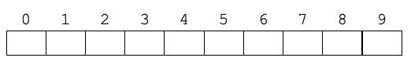
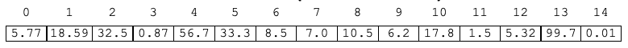
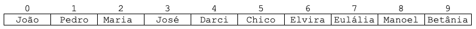
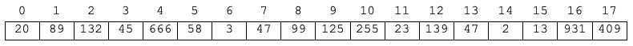
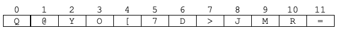
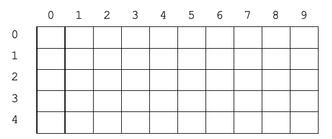

# Introdução à Programação - Unidade 6

Algumas anotações feitas em aula: [aulaAnotacoes.md](./aulaAnotacoes.md "aulaAnotacoes.md")

## Tipos Estruturados

### [Videoaula_6 (30:10)](<https://furb-my.sharepoint.com/:v:/g/personal/dalton_furb_br/EX_iq35CPStNi5sUo4-50lMBGlb13PLZwWYRJvCjZjciMg?e=SeiiIB> "link alternativo da videoaula da unidade 6")

### Tipo Estruturados: exemplos

- Os problemas computacionais muitas vezes exigem o armazenamento de grande quantidade de dados em memória para posterior processamento.​
- Exemplo 1: dado o nome de 50 pessoas, escrever estes dados em ordem alfabética.
  - Problema: neste caso criaríamos uma variável para cada nome? E se fossem 1000 nomes?​
- Exemplo 2: uma loja registrou em um dia a quantidade vendida de cada um de seus 200 produtos. Informe o código dos produtos que tiveram vendas acima da média.
  - Problema: neste caso criaríamos 200 variáveis, uma para cada produto?​
- Exemplo 3: a loja do exemplo 2 quer fazer um controle mensal de suas vendas. Para isto ela mantém os dados de cada um de seus produtos vendidos em cada dia do mês.
  - Problema: quantas variáveis teríamos que criar neste caso?​
- Exemplo 4: uma pessoa quer ir de uma cidade A até uma cidade F. Considerando que há vários caminhos possíveis e que são registradas as distâncias intermediárias entre as cidades (ex. de A a B, de B a C, de B a D, etc.) informe o caminho que tem a menor distância entre A e F.
  - Problema: neste caso quantos caminhos vamos armazenar? Como vamos totalizar parcialmente as distâncias de cada caminho?​
​

### Tipo Estruturados: solução

- Para a solução destes exemplos é necessário o uso de **estruturas de dados**.​
- As estruturas de dados ampliam o conceito de variáveis, pois permitem armazenar diversas informações a partir da definição de uma única variável.​
- Existem diversos **tipos de estruturas de dados**, tais como, vetores, matrizes, listas, filas, pilhas, árvores, arquivos, entre outras.​

### Tipo Estruturados Unidimensionais (Vetores)

- Os **Tipos Estruturados Unidimensionais** permitem armazenar diversos dados de um mesmo tipo (homogêneos) em uma única variável​
- Os **Tipos Estruturados Unidimensionais** também são conhecidos como **Vetores​**
- Cada dado armazenado é identificada por um **índice**, que é a posição em que o mesmo se encontra dentro da estrutura​
- O **índice** define a posição do elemento no vetor​
- A representação mais comum para um Vetor é uma tabela indexada, conforme o exemplo a seguir:​

- No exemplo foi definida uma estrutura de 10 valores, ou seja, nela podem ser armazenados até 10 valores de um determinado tipo de dado​
- OBS. No Java o índice do primeiro elemento de um vetor é zero. Vamos adotar esta prática, tendo em mente que nem todas as linguagens funcionam assim​
- As informações em um vetor são identificadas por um índice que normalmente é dado entre colchetes **[]​**

- Exemplos de Vetores em Computador:​
  - Vetor de números reais (tamanho: 15)​: nesse vetor a posição \[6] armazena 8.5

  - Vetor de nomes (tamanho: 10)​: nesse vetor o elemento da posição \[2] é “Maria”

  - Vetor de números inteiros (tamanho: 18)​: nesse vetor o elemento da posição \[14] é 2​
​
  - Vetor de caracteres (tamanho: 12)​: nesse vetor a posição \[10] armazena ‘R’;​


- Sintaxe e exemplo do uso de Tipos Estruturados Unidimensionais (**Vetores**):

- Em Java:​
  
```java

    int vetorInteiro[] = new int[10];     // Declaração  
    vetorInteiro[0] = 11;                 // atribuir o valor 11 ao primeiro elemento do vetor
    vetorInteiro[9] = 22;                 // atribuir o valor 22 ao último elemento do vetor
    int varInteiro9 = vetorInteiro[9];    // atribuir o último elemento do vetor para uma variável
    int varInteiro0 = vetorInteiro[0];    // atribuir o primeiro elemento do vetor para uma variável

```

- Em Java:​

  ```java

    int valores[] = new int[15];     // Declaração
    for (int cont=0; cont<15; cont++) {
      valores[cont] = cont;
    }

  ```

### Tipo Estruturados Unidimensionais (Vetores): denominação

- **tipo**: define os elementos que serão armazenados no vetor. Podem ser tipos simples ou classes.​
- **tamanho**: define o número de elementos do vetor.​
- **índice**: define a posição do elemento no vetor. Pode ser definido através de valores constantes, variáveis ou expressões. ​

### Tipo Estruturados Unidimensionais (Vetores): N-Dimensões

- Existem tipos estruturados n-dimensionais. Por exemplo, os **tipos estruturados bidimensionais** permitem organizar elementos em **linhas** e **colunas**
- Os tipos estruturados bidimensionais são comumente chamados de **Matrizes**


----------

### Principais Referências Bibliográficas​

DEITEL, Paul J; DEITEL, Harvey M. **[Java: como programar](https://bu.furb.br/consulta/portalConsulta/recuperaMfnCompleto.php?menu=rapida&CdMFN=341002)**. 8. ed. São Paulo: Pearson, 2010. xxix, 1144 p, il.​

HORSTMANN, Cay S. **[Big Java](https://bu.furb.br/consulta/portalConsulta/recuperaMfnCompleto.php?menu=rapida&CdMFN=271388)**. Porto Alegre : Bookman, 2004. xi, 1125 p, il. , 1 CD-ROM.​

SCHILDT, Herbert; HOLMES, James. **[A arte do Java](https://bu.furb.br/consulta/portalConsulta/recuperaMfnCompleto.php?menu=rapida&CdMFN=257427)**. Rio de Janeiro : Elsevier : Campus, c2003. xvi, 382 p, il.​

----------

## ⏭ [Voltar)](../README.md "Voltar")  
