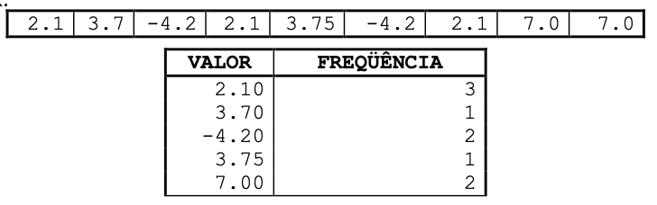

# Lista de Exercícios - Unidade 6 - Tipos Estruturados Unidimensionais

Implemente  uma  classe  com  o  método  main  para  cada  um  dos seguintes  exercícios utilizando o VSCode. Faça a análise do problema identificando as entradas, saídas e testes. Utilize  somente  os  comandos  que  você  aprendeu  na  disciplina  até  o  momento  para  a resolução das atividades.

Utilize o nome do arquivo Java e da Classe de acordo com o indicado no inicio de cada enunciado.

E agora podemos usar métodos para resolver os exercícios abaixo.

----------

## Vetores de Tamanho definido no código

----------

**Uni6Exe01.java** - Descreva um algoritmo que leia 10 números inteiros e os coloque em um vetor de 10 posições do tipo inteiro. Escreva na ordem inversa em que foram lidos. Faça um método para ler e outro para escrever.

----------
**Uni6Exe02.java** - Descreva um algoritmo que leia 12 valores reais e os coloque em um vetor de 12 posições do tipo real. Imprima quais valores desses informados são maiores que a média dos valores. Faça um método para ler os valores, outro para calcular a média e outro para informar os valores maiores que a média.

----------
**Uni6Exe03.java** - Descreva um algoritmo que leia 12 valores reais e os coloque em um vetor de 12 posições do tipo real. Em seguida, modifique o vetor de modo que os valores das posições ímpares sejam aumentados em 5% e os das posições pares sejam aumentados em 2%. Imprima o vetor resultante. Faça um método para ler os valores, outro para ajustar os valores dentro do vetor e outro para escrever os valores atualizados do vetor.

----------
**Uni6Exe04.java** - Faça um programa para ler os valores de dois vetores de inteiros, cada um contendo 10 elementos. Crie um terceiro vetor em que cada elemento é a soma dos valores contidos nas posições respectivas dos vetores originais. Por exemplo, vetor1 = \[1,2,3] vetor2 = \[1,5,6] vetor3 = \[2,7,9]. Exiba, ao final, os três vetores na tela. Faça três métodos: um método para ler valores dos vetores, outro para somar e outro para escrever os vetores.

----------
**Uni6Exe05.java** - Com o objetivo de determinar o índice de afinidade entre um rapaz e uma moça cada um respondeu um questionário com 5 perguntas, como por exemplo:

- Gosta de música sertaneja?
- Gosta de futebol?
- Gosta de seriados?
- Gosta de redes sociais?
- Gosta da Oktoberfest?

A resposta a cada pergunta pode ser: SIM, NÃO ou IND (indiferente). O índice de afinidade é medido da seguinte maneira:

- se ambos deram a mesma resposta soma-se 3 pontos ao índice;
- se um respondeu IND e o outro SIM ou NÃO soma-se 1;
- se um respondeu SIM e o outro NÃO subtrai-se 2 ao índice.

Crie  um  vetor  para  armazenar  as  respostas  do  rapaz  e  outro  para  armazenar  as respostas da moça. Crie um método que possa ler tanto as respostas do rapaz como da moça, e outro para calcular e retornar  a  afinidade.  Por  fim, escreva  a  afinidade  considerando  os  seguintes intervalos:

| Afinidade | Mensagem                          |
|-----------|-----------------------------------|
| 15        | “Casem!                           |
| 10 a 14   | “Vocês têm muita coisa em comum!” |
| 5 a 9     | “Talvez não dê certo :(”          |
| 0 a 4     | “Vale um encontro.”               |
| -1 a -9   | “Melhor não perder tempo”         |
| -10       | “Vocês se odeiam!”                |

----------

## Vetores de Tamanho informado

----------
**Uni6Exe06.java** - Faça um programa que leia um valor N inteiro. Com base neste valor, crie um vetor do tipo real. Em seguida, solicite ao usuário informar essa quantidade N de valores reais para popular o vetor. Após ter preenchido o vetor, solicite que o usuário informe um outro valor real. Informe para o usuário se este valor informado se encontra cadastrado no vetor. Faça  um  método  para  ler  o  vetor e outro, que retorne verdadeiro ou falso, para encontrar o valor.

----------
**Uni6Exe07.java** - Faça um programa que leia um valor N inteiro limitado a 20 posições. Com base neste valor, crie um vetor do tipo inteiro. Em seguida, solicite ao usuário para digitar um número inteiro várias vezes, até preencher o vetor. Esse número deverá ser armazenado no vetor caso ainda não exista, e se o valor já existir deve ser pedido um novo valor. Isto é, se o usuário informar o número 2 e já existir o número 2 em alguma posição do vetor, o número não deve ser adicionado. Após ter adicionado todos os números dentro do vetor, o mesmo deve ser ordenado. Para isso reordene os elementos internos do vetor de modo que este fique em ordem crescente, conforme no exemplo:

Vetor origem: \[0]\[4]\[2]\[6]\[3]  
Vetor ordenado: \[0]\[2]\[3]\[4]\[6]

Crie um método para inserir os valores no vetor, outro para ordenar o vetor e outro para informar o vetor resultante. Para "método ordenar" se pode usar o "método bolha" explicado neste [vídeo](https://furb-my.sharepoint.com/:v:/g/personal/dalton_furb_br/Ec87A5jXv7VIkfpLSUyvbuYBrPSf3pXBO4lIWOj3TTMH1A?e=mugb45).

----------
**Uni6Exe08.java** - Faça um programa que leia um valor N inteiro limitado a 20 posições. Com base neste valor, crie um vetor do tipo real. Faça o usuário informar valores para as posições deste vetor e coloque-as nas posições na sequência informada pelo usuário. Imprima  uma tabela contendo cada valor diferente e o número de vezes que o valor aparece no vetor (veja exemplo a seguir).

----------
**Uni6Exe09.java** - Um cinema pretende fazer uma pesquisa para avaliar o grau de satisfação de seus clientes. Trinta deles foram ouvidos e para cada um perguntou-se o sexo (1=feminino 2=masculino), uma nota para o cinema (zero até dez, valor inteiro) e a idade.

Baseado nisto faça um programa que informe:

- qual a nota média recebida pelo cinema;
- qual a nota média atribuída pelos homens;
- qual a nota atribuída pela mulher mais jovem;
- quantas das mulheres com mais de 50 anos deram nota superior a média recebida pelo cinema.

Utilize os conceitos aprendidos sobre vetores (ou mesmo o uso de matriz) e métodos para a resolução deste exercício.

----------
**Uni6Exe10.java** - Dado um vetor de números inteiros, com capacidade limitada a 50 elementos, faça um programa que construa um menu com as seguintes opções:

- “1 – Incluir valor”: nesta opção inclua o valor no fim do vetor, se houver espaço. Informe o usuário se o valor foi incluído no vetor ou não;
- “2 – Pesquisar valor”: nesta opção leia um valor e informe se o mesmo está no vetor;
- “3 – Alterar valor”: nesta opção informe um número a ser alterado e um novo número a ser colocado no lugar (só para a primeira ocorrência deste número). Caso o número a ser alterado exista no vetor, substitua-o pelo novo número. Caso contrário, informe “número não encontrado”;
- “4 – Excluir valor”: nesta opção leia um valor e, caso ele esteja no vetor, exclua-o. Informe o usuário se o valor foi excluído do vetor ou não. A posição que foi excluída o valor deve ser preenchida pelo valor seguinte, sucessivamente até o final dos valores do vetor;
- “5 – Mostrar valores”: nesta opção mostre todos os valores armazenados no vetor;
- “6 – Ordenar valores”: ordene todos os valores do vetor em ordem crescente;
- “7 – Inverter valores”: desafio (ver abaixo);  
- “8 – Sair do sistema”: nesta opção deve ser finalizada a execução do programa.

Faça um método para cada uma das opções do menu. O menu deve-se repetir até que o usuário escolha a opção 8.  
Para a opção "6 - Ordenar valores" se pode usar o "método bolha" explicado neste [vídeo](https://furb-my.sharepoint.com/:v:/g/personal/dalton_furb_br/Ec87A5jXv7VIkfpLSUyvbuYBrPSf3pXBO4lIWOj3TTMH1A?e=mugb45). Existem também outros vídeos que mostram a lógica de ordenação usando o "método bolha", no caso é só procurar por "Bubble Sort". Um deles é [Bubble Sort | GeeksforGeeks](<https://www.youtube.com/watch?v=nmhjrI-aW5o> "Bubble Sort | GeeksforGeeks"). Um outro um pouco mais "divertido" procura mostrar a lógica usando uma coreografia de dança: [Bubble sort with Hungarian, folk dance](https://www.youtube.com/watch?v=Iv3vgjM8Pv4 "Bubble sort with Hungarian, folk dance").  

**Desafio:** adapte o código acima para ter mais uma opção no menu para também poder inverter os elementos dentro de um vetor. Assim o último elemento passa a ser o primeiro, o penúltimo passa ser o segundo, e assim sucessivamente para todos os elementos da lista. Mas lembre, não se deve considerar o vetor inteiro, mas somente os elementos que já foram adicionados no vetor. Como base use o código descrito em [vetorInverter.java](https://gist.github.com/dalton-reis/1c5f2bdf65b251730e1cb76c5a61bb1b).

----------
