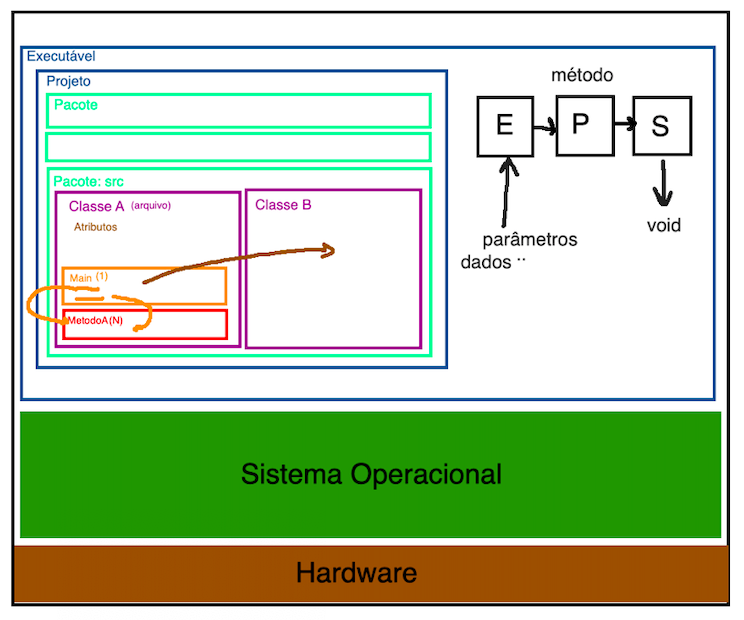

<!--  FIXME:
### [Aula_34](Unidade6/aulaAnotacoes.md#Aula_34 "	09-05-2022	segunda	")	09-05-2022	segunda
### [Aula_35](Unidade6/aulaAnotacoes.md#Aula_35 "	11-05-2022	quarta		11-05-2022	quarta
### [Aula_36](Unidade6/aulaAnotacoes.md#Aula_36 "	11-05-2022	quarta	")	11-05-2022	quarta
### [Aula_37](Unidade6/aulaAnotacoes.md#Aula_37 "	16-05-2022	segunda	")	16-05-2022	segunda
### [Aula_38](Unidade6/aulaAnotacoes.md#Aula_38 "	18-05-2022	quarta		18-05-2022	quarta
### [Aula_39](Unidade6/aulaAnotacoes.md#Aula_39 "	18-05-2022	quarta	")	18-05-2022	quarta
-->

# Algumas anotações das aulas

E daí, querem ficar "famosos" e "ricos" ... então tentem resolver este desafio ...
  [P versus NP](https://pt.wikipedia.org/wiki/P_versus_NP "P versus NP")  

## Rabiscos


## Introdução à Programação - Unidade 6

## Aula [34 e 35]

<!-- TODO: comentar para usar Try/Catch com "moderação"
ver exemplo de código do ue não deve ser feito em: [ExemploTryCatch](ExemploTryCatch.java "ExemploTryCatch")  
Mais explicação ver: [tryCatch](tryCatch.md "tryCatch")  
-->

<!-- FIXME:
Explicar sobre new para alocar espaço para vetores feita por [offset.numbers](fluxogramas/offset.numbers). E esta explicação poderia ser melhor "desenha" usando <https://www.planttext.com> com o exemplo 03 - Data Structures.-->  

## Aula [36]

### Explicação sobre Métodos  

Código de exemplo: sem seguir um enunciado  

[CaixaAreia](src/CaixaAreia.java)  

Métodos -> Paradigma .. Orientação a Objeto (OO)  
- Escopo dos métodos:   

- explicar um "pouco" -> mais explicação na disciplina de Orientação à Objetos (próximo semestre)  
- Nome do arquivo Java define o nome Class  
  - todo arquivo java só tem uma classe  
- Métodos Main ->   public static void main(String[] args)  
- porta entrada para executar o código  
- só pode ter um método main no nosso código a ser executado  

Método Construtor _ método "especial"  

- se usa muito construtores em OO  
- usaremos também para evitar o uso do static  
- static: tenta não usar -> fugir :-(  
- não tem "void"  

Métodos _ os meus métodos  

```java
  private void testeAula(int a, double b) { /* ... */ }
```

- assinatura  
  - [ ] **private**: visibilidade -> private (sem usar private por enquanto)  
  - [ ] **void**: retorno void ou tipo -> saída (opcional)  
  - [ ] **testeAula**: nome (mesma ideia ao dar nomes das variáveis)  
  - [ ] **(int a, double b)**: parâmetros  
    - Entrada do método (opcional)  
      - passagem por valor: conteúdo da variável  
      - passagem por referência: ponteiro (endereço)  
  - [ ] **{ /* ... */ }**: bloco/escopo  
    - { todo o meu código} -> processo (opcional)  

- visibilidade da Classe ou Método: public, protected, private  
  - public é o valor default  
  - .. recomendação usar nesta ordem: private, protected, public  

[ExemploMetodos](src/ExemploMetodos.java "ExemploMetodos")  
[ExemploMetodoOrdenarTresValores](src/ExemploMetodoOrdenarTresValores.java "ExemploMetodoOrdenarTresValores")  
[Uni4Exe14Teste.java](src/Uni4Exe14Teste.java "Uni4Exe14Teste.java")  
- [ ] [ExemploMatriz.java](src/ExemploMatriz.java "ExemploMatriz.java")  <!-- prof. completo -->  


## Aula [37 e 38]

Vetores de Tamanho definido no código  

- [ ] [Uni6Exe01.java](src/Uni6Exe01.java "Uni6Exe01.java")  <!-- prof. completo -->  
- [ ] Uni6Exe02.java  
- [ ] Uni6Exe03.java  
- [ ] Uni6Exe04.java  
- [ ] Uni6Exe05.java  

Vetores de Tamanho informado  

- [ ] [Uni6Exe06.java](src/Uni6Exe06.java "Uni6Exe06.java")  <!-- prof. completo -->  
- [ ] [Uni6Exe07.java](src/Uni6Exe07.java "Uni6Exe07.java")  <!-- prof. completo -->  
- [ ] Uni6Exe08.java  
- [ ] [Uni6Exe09.java](src/Uni6Exe09.java "Uni6Exe09.java")  <!-- prof. completo -->  

## Aula [39]

Aula para tirar dúvidas e resolver os exercícios  

## Aula [40 e 41]

Exemplo mais completo:  

- [ ] [Uni6Exe10.java](src/Uni6Exe10.java "Uni6Exe10.java")  <!-- prof. completo -->  

  [ ] 8 – Sair do sistema  
  [ ] 5 – Mostrar valores  
  [ ] 1 – Incluir valor  
  [ ] 2 – Pesquisar valor  
  [ ] 3 – Alterar valor  

## Aula [42]

  [ ] 4 – Excluir valor  
  [ ] 6 – Ordenar valores  
  [ ] 7 – Inverter valores  
